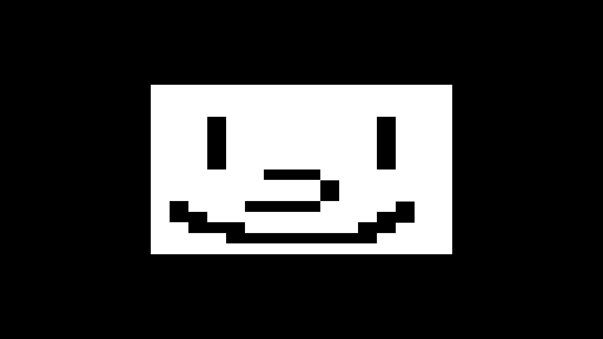
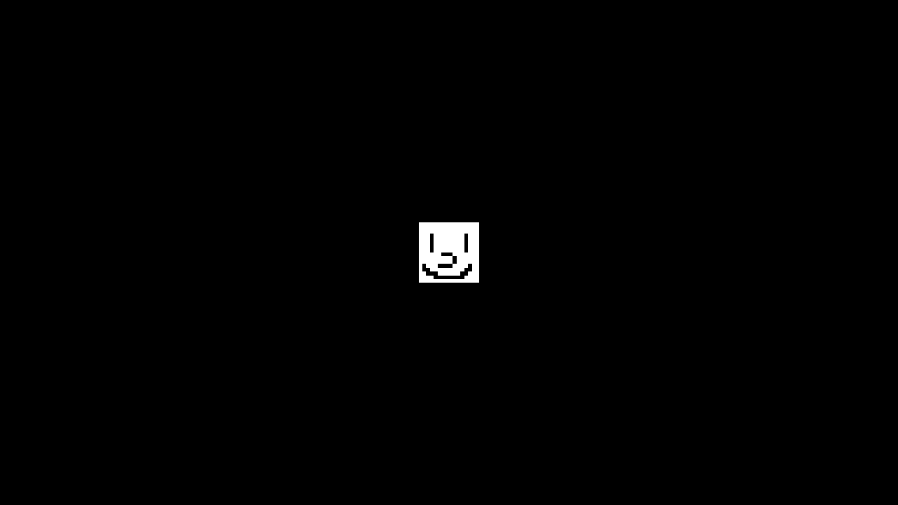

Up until last week, I have been working on the base rendering, textures, and 3D projection which all felt vaguely familiar (*cough cough..[TF2 OpenGL & Java](https://github.com/joshuafhiggins/tf2-opengl)..cough cough*). As well as a basis for mod loading.

But for this week, I didn't do much (*less than I wanted to*) but I did do research into physics, cameras, model loading, and entity component systems/ECS.

## Base Rendering
I'm really happy with the way this got done. The mesh class makes a bunch of BufferObjects that hold the OpenGL pointers and have base functions for cleanup. This allows very easy derivatives of the Mesh class for whatever they needed.


public class FooMesh extends Mesh {
    //...

    @Override
    public void Create() {
        //Make our VAO
        VAO = new BufferObject.VAO();
            VAO.Bind();
            //Array of non specific BufferObjects
            bufferObjects[0] = new BufferObject.VBO(vertices, 0);
            //Static classes that inherit BufferObject. 
            //These are binded and attached with no intervention
            bufferObjects[1] = new BufferObject.CBO(vertices, 1);
            bufferObjects[2] = new BufferObject.TBO(vertices, 2);
            IBO = new BufferObject.IBO(indices);
        VAO.Unbind();
    }

    //...

   //Rendering, method calls are pretty self explanatory. 
   //Inputs aren't final.
   //I'm not happy with the Entity being passed in for rendering when Entity's hold meshes
    public void Render(Entity entity, Camera camera) {
        VAO.Bind();
            enableVertexAttrib();
                IBO.Bind();
                    material.Bind();
                        shader.Bind();
                            SetUniforms(entity, camera);
                            DrawElements();
                        shader.Unbind();
                    material.Unbind();
                IBO.Unbind();
            disableVertexAttrib();
        VAO.Unbind();
    }
}


Derivatives were made when going through the tutorials but were ultimately removed for the approach of having a better base because having a different Mesh for color and then for texture and then color, but color is never used... It was just a headache for general refactoring and keeping them up to date. A lot of buffer stuff was taken from TF2 in Java & OpenGL.

## Textures
Right now, only Albedo is being used and the Material class is nothing but a holder for SlickUtil Textures. I want the Material class to hold all of the textures without order and you leave it to modders to make their shaders and textures line up. I'm only using SlickUtil right now because of the ability to load Textures from class resources rather than the file path. But I'm ultimately going to replace it with my one Texture class because of the [model loader](#Model Loading) not using class resources. Supposedly we can load from resources, and call the function to load model from memory or textures from memory with STB, but I have no idea what the size of the buffers should be.

## 3D Projection
JOML is being used for math and matrix loading and what not but this may change (see [the physics section](#physics)). Once I did this, it kinda made me think about what next. I thought I should focus on an ECS system for holding positions, rotations, etc. which right now is the Entity class that should be derived from but will change (see [the ECS section](#ecs)). This was kind of the thing that spun off into the unproductive week. Although this was not easy at all because the shader was originally going from different matrices in the wrong order.


//...

uniform mat4 model;
uniform mat4 view;
uniform mat4 projection;

void main() {
    //How it should be: 
    //gl_Position = vec4(position, 1.0) * model * view * projection;

    gl_Position = projection * view * model * vec4(position, 1.0);
    
    //...
}


But here it is now working just right:

## Mod Loading
The Main class no longer holds any GLFW and is instead held in the Window class, similar to the Mesh class and BufferObjects. Mods right now hold a lot of control over what's happening. This is still subject to change because while this was going to be a render engine, it quickly became this bigger thing and the order of events right now is: Rendering (v0.1) -> ECS/Physics (v0.2) -> Audio/Sound (v0.3) -> Events/Mod Loading (v0.4). So we aren't even done with v0.1 and shouldn't worry about the specifics of this just yet. I just want to emphasize that this is a render engine before a game engine, no matter how much I want the latter.

## Cameras
Absolute pain, never again. Jokes aside I just need to do more research because right now it looks like this:



Should just leave it static right now with no movement...

## Physics
Well, more of the research of it for Java. The best solution would be to use [JBullet](http://jbullet.advel.cz/), an outdated port of Bullet. It's the easiest to set up and using LibGDX port while similar, has no real prebuilt support for shapes and has to be done manually. LWJGL has a binding, but with a client-server architecture which is just terrible for doing anything simple. The only problem is, it uses javax.vecmath while right now I'm using JOML. Managing both is a pain and javax.vecmath has Transform objects, similar to Unity, so I'm gonna need to refractor a lot to use vecmath.

## ECS
For ECS I'm gonna go with [Ashley](https://github.com/libgdx/ashley), a LibGDX solution. It seems like the only one used for games but not hard to build from scratch either, as a concept. Of course, I'm not going to dump a bunch of hours into custom-made when this is good enough. Although I don't know much in this and it is mainly up to developers on how they should organize this and this may change.

## Model Loading
This is in no way finished as it is not grabbing all possible data right now, which is kind of driving me nuts but I'm gonna try to ignore it for now until the data being grabbed, like material data, can be used in engine. Here it is so far, using the smiley texture and the dragon model:

