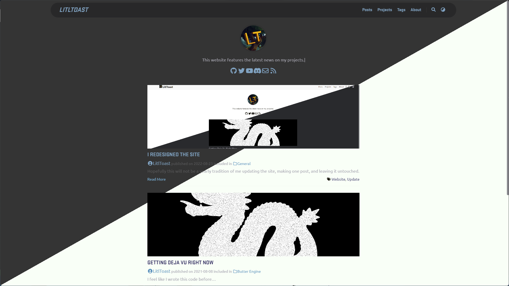
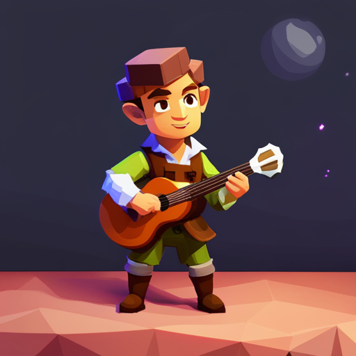
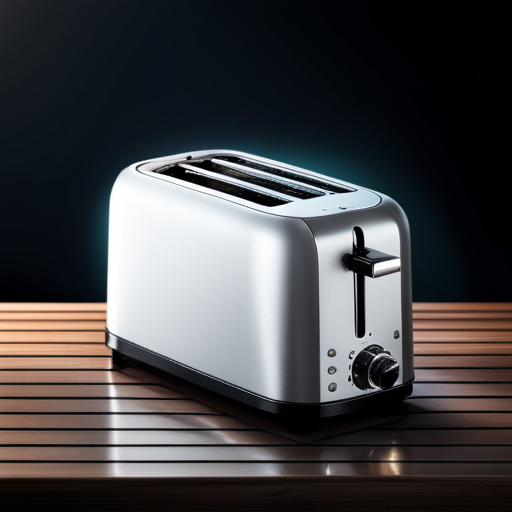



<!--more-->

## Updated Website

```
Changes:
- Redid color palette for light and dark mode
- New header with translucency
- Rounded scroll bar
- Replaced fonts with Ubuntu, JetBrains Mono, and Stratum 2 (from Counter-Strike 2)

Known Bugs:
- General: Dark mode is too blue
- Mobile: Hamburger menu missing when reading a post, this existed before but really shouldn't have
```



Light theme looks better than before, and better than dark mode in my opinion. The new header bar is inspired by Hearthstone's website too, although I kept some of the old design on mobile. Several changes had to be made to the theme itself, at some point I need to find a way to move all changes that were made to `_override.scss`. Maybe now I'll make an update post for Prank Suite?

## Discord Server

I made a [Discord server](https://discord.gg/b48D4m8jNs)! There's channels for asking for help with Java, Kotlin, and Rust, as well as helpful resources. I encourage everyone to put your favorite resources for the languages in their respective channels. I often forget cool things I find and this will be my way of having a whole list to revisit anytime I want. You can also showcase your projects as a thread in the [`#showcase`](https://discord.gg/b48D4m8jNs) channel. I look forward to seeing you there!

 

## Plans & Current Projects

If you have been following my GitHub while this website was abandoned, I've been making projects in Rust and loving them. I'm going to be moving Butter Engine to Rust and have progressed about as far as the last blog post on the Engine, in terms of rendering. This would be the 3rd time I have redone Butter Engine, and ultimately I don't care! Rust is forcing me to write better code for when I build off of the engine in the future and I felt that moving forward with what I have in Java would be a headache in many ways. I'll make this into it's own post, but for right now I want to move all my workflows to Rust to learn it better. I guess that means I need to find a Hugo alternative but I'll wait another year and no blog posts for that 😉.

So to recap, I have a new [Discord server](https://discord.gg/b48D4m8jNs) for programmers, made the website look nice, my life in Rust, two more posts coming next week, and who knows what will happen after this break ends?